# TODO-智能代办时间管理系统

## 1.介绍:

​	本 App 为用户提供时间计时、新闻推送和数据分析等功能，帮助用户合理安排工作时间。通过订阅 功能,系统可以帮助用户监测订阅内容是否更新,进而将更新的内容推送到新闻模块,帮助用户专注学习，无需 时刻关注内容更新。并利用基于用户的协同过滤算法实现每日的新闻推荐。

## 2.技术栈

* Android
* Flask
* MySQL

## 3.数据库

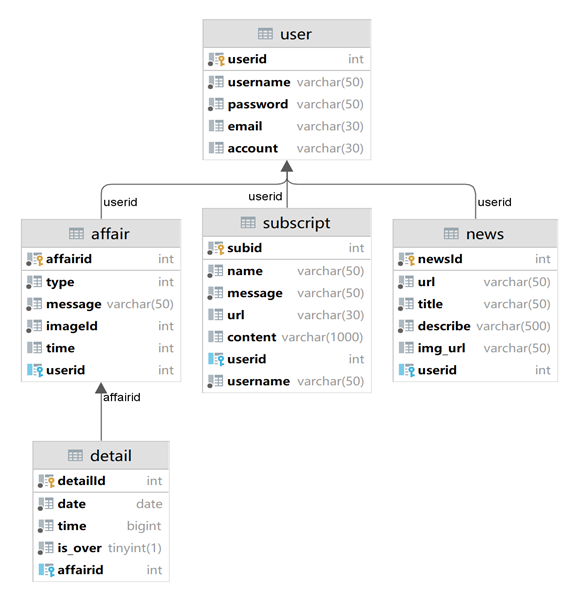

## 4.部分页面展示
**封面:**

**登录:**
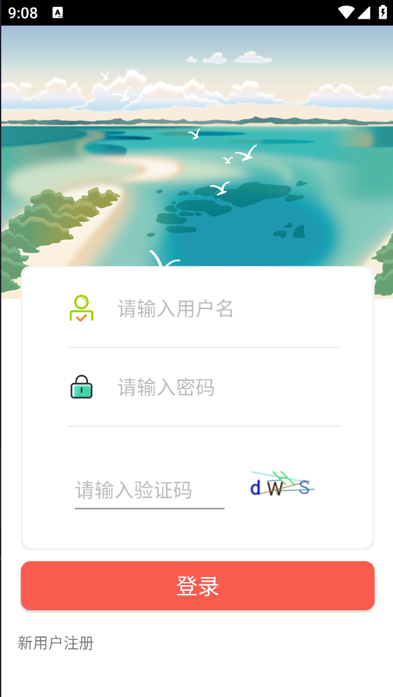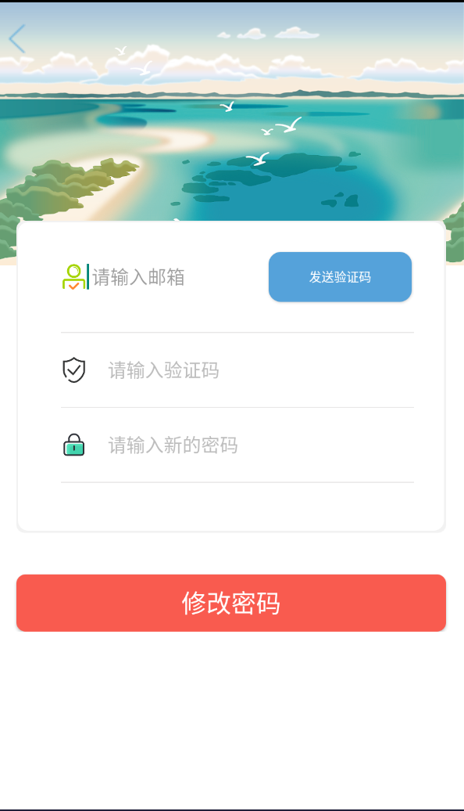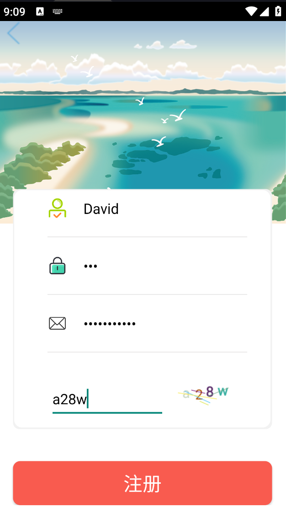
**代办:**
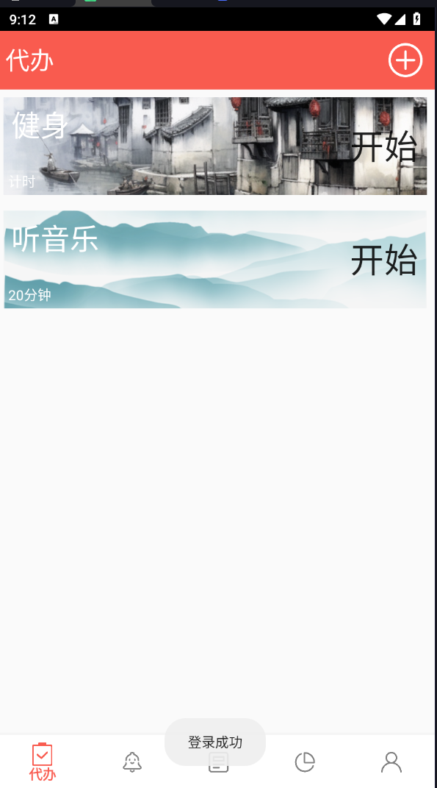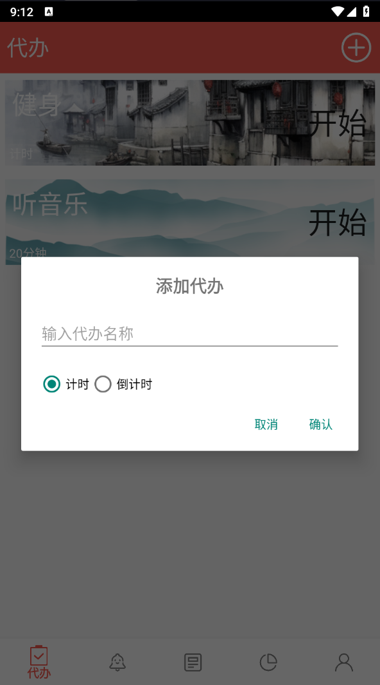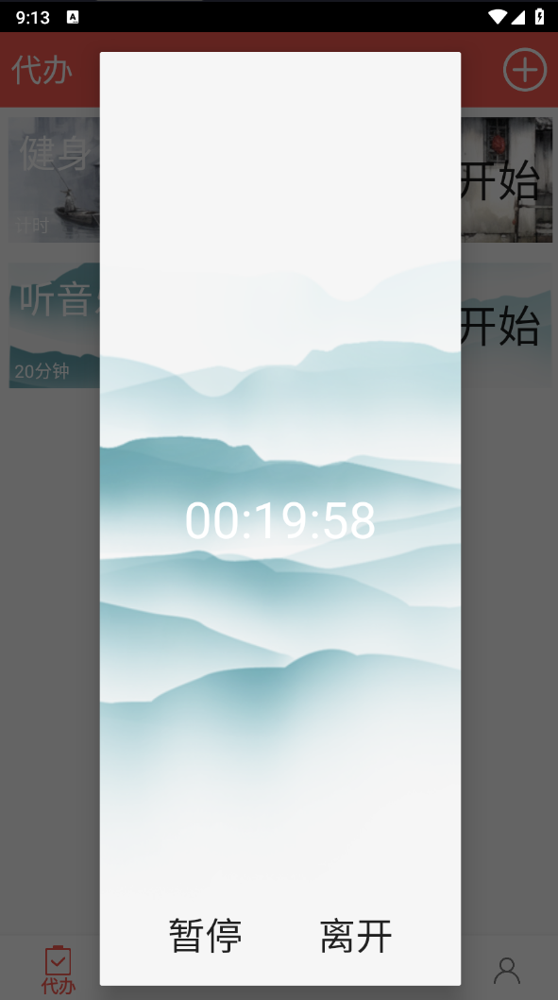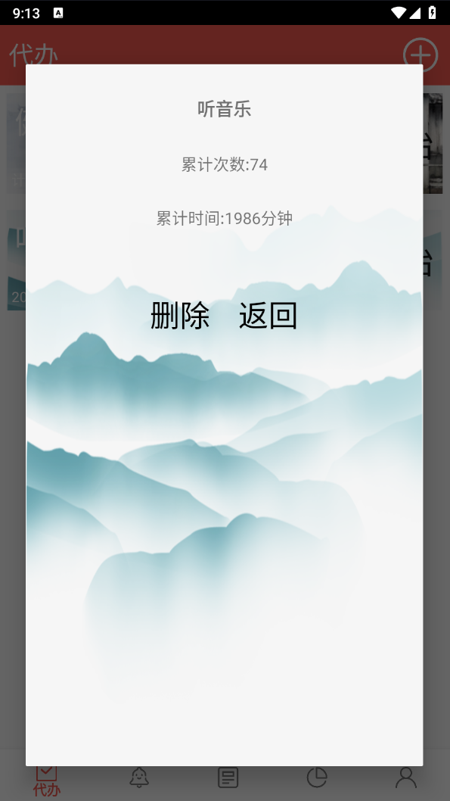
**数据分析:**
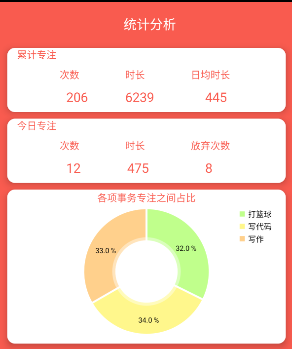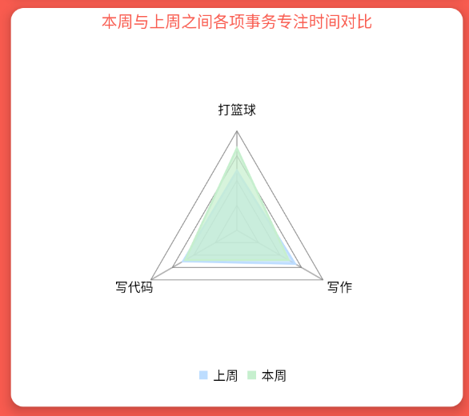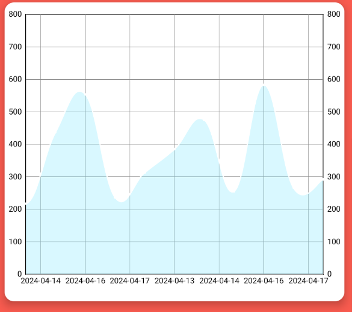
**订阅:**
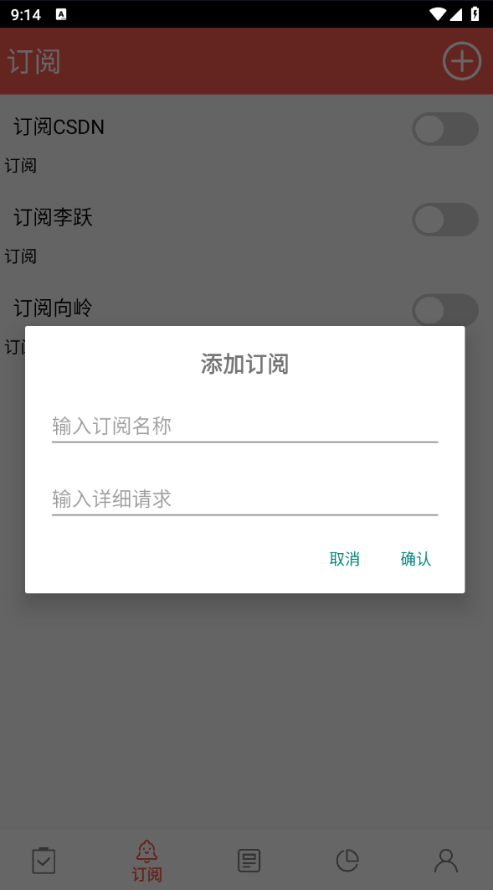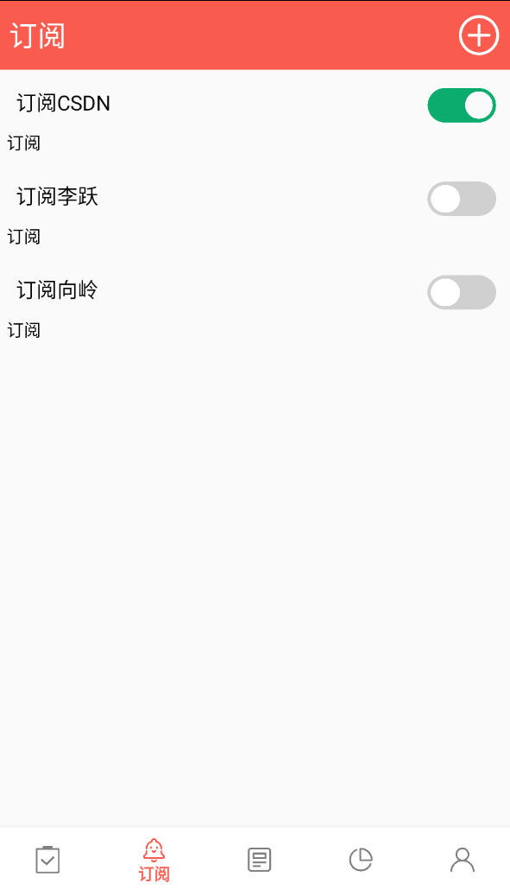![content]
**新闻:**
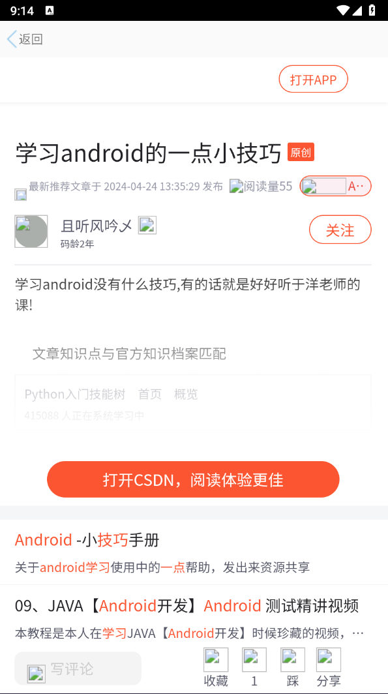![content]
